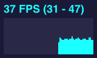
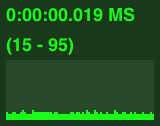

stats.dart
==========

#### Dart Performance Monitor ####

This class provides stats box that will help you monitor your code performance.

* **FPS** Frames rendered in the last second. The higher the number the better.
* **MS** Milliseconds needed to render a frame. The lower the number the better.

### Screenshots ###




### Live Example ###

[example](example/basic/statsdart.html)

### Getting Started ###
Create a dart project and add a **pubspec.yaml** file to it.

Using [pub.dartlang.org](http://pub.dartlang.org/packages/stats)

```
dependencies:
  stats: 0.0.3
```

Using bleeding edge code from github. 

```
dependencies:
  stats:
    git: https://github.com/Dartist/stats.dart.git
```

run `pub install` to install **stats** (including its dependencies). Use the following import statement.

```
import 'package:stats/stats.dart';
```

### Example ###

```dart
import 'dart:html';
import 'package:stats/stats.dart';
void main() {
  Stats stats = new Stats();
  document.body.children.add(stats.container);
  CanvasElement canvas = new CanvasElement();
  canvas.width = 512;
  canvas.height = 512;
  document.body.elements.add(canvas);
  CanvasRenderingContext2D context = canvas.getContext('2d');
  context.fillStyle = 'rgba(127,0,255,0.05)';
  
  draw(time) {
    context.clearRect(0, 0, 512, 512);

    stats.begin();

    for (var i = 0; i < 2000; i++) {

      var x = Math.cos(time + i * 0.01) * 196 + 256;
      var y = Math.sin(time + i * 0.01234) * 196 + 256;

      context.beginPath();
      context.arc(x, y, 10, 0, Math.PI * 2, true);
      context.fill();

    }

    stats.end();
    window.requestAnimationFrame(draw);
  }
  
  window.requestAnimationFrame(draw);
}
```

### Thanks ###
[mrdoob](http://mrdoob.github.com/stats.js/) for the stats.js code. 
